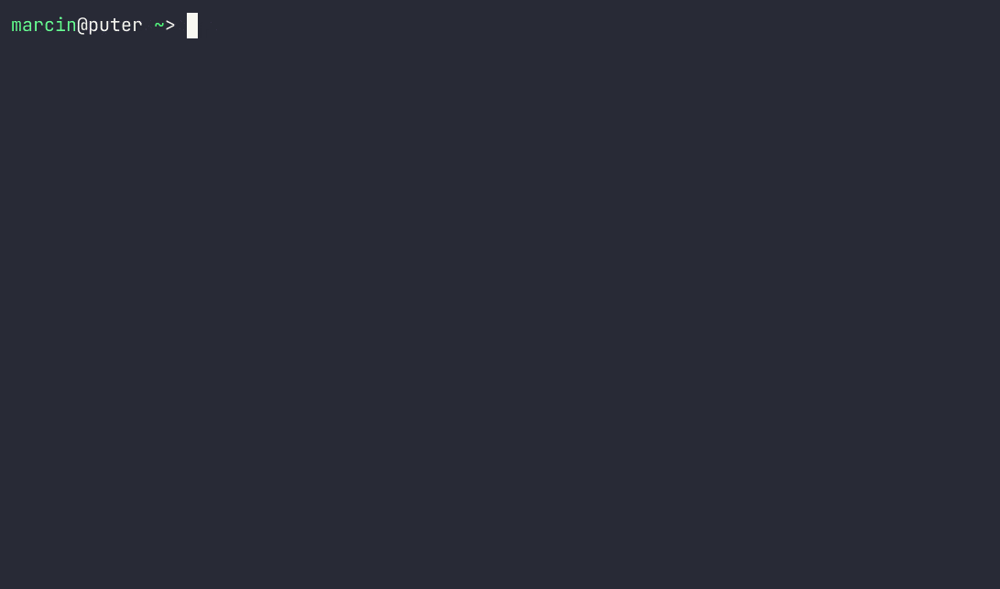

# agg - asciinema gif generator

agg is a command-line tool for generating animated GIF files from [asciicast v2
files](https://github.com/asciinema/asciinema/blob/master/doc/asciicast-v2.md)
produced by [asciinema terminal
recorder](https://github.com/asciinema/asciinema).

It uses Kornel Lesiński's excellent
[gifski](https://github.com/ImageOptim/gifski) library to produce optimized,
high quality GIF output with accurate frame timing.

agg is a successor to
[asciicast2gif](https://github.com/asciinema/asciicast2gif).



## Building

Building from source requires [Rust](https://www.rust-lang.org/) compiler and
[Cargo package manager](https://doc.rust-lang.org/cargo/). You can install both
with [rustup](https://rustup.rs/).

To build agg run:

```bash
cargo build -r
```

This produces an executable file at `target/release/agg`. There are no other
build artifacts so you can copy the binary to a directory in your `$PATH`.

## Usage

Basic usage:

```bash
agg demo.cast demo.gif
```

The above command renders a GIF file with default theme (dracula), font size
14px.

Additional options are available for customization. For example, the following
command selects Monokai theme, larger font size, 2x playback speed:

```bash
agg --theme monokai --font-size 20 --speed 2 demo.cast demo.gif
```

Run `agg -h` to see all available options. Current options are:

```
    --font-dir <FONT_DIR>
        Use additional font directory

    --font-family <FONT_FAMILY>
        Specify font family [default: "JetBrains Mono,Fira Code,SF Mono,Menlo,Consolas,DejaVu
        Sans Mono,Liberation Mono"]

    --font-size <FONT_SIZE>
        Specify font size (in pixels) [default: 14]

    --fps-cap <FPS_CAP>
        Set FPS cap [default: 30]

-h, --help
        Print help information

    --idle-time-limit <IDLE_TIME_LIMIT>
        Limit idle time to max number of seconds [default: 5]

    --line-height <LINE_HEIGHT>
        Specify line height [default: 1.4]

    --renderer <RENDERER>
        Select frame rendering backend [default: fontdue] [possible values: fontdue, resvg]

    --speed <SPEED>
        Adjust playback speed [default: 1]

    --theme <THEME>
        Select color theme [possible values: asciinema, dracula, monokai, solarized-dark,
        solarized-light, custom]

-v, --verbose
        Enable verbose logging

-V, --version
        Print version information
```

### Color themes

There are several built-in color themes you can use with `--theme` option:

- asciinema
- dracula (default)
- monokai
- solarized-dark
- solarized-light

If your asciicast file includes [theme
definition](https://github.com/asciinema/asciinema/blob/develop/doc/asciicast-v2.md#theme)
then it's used automatically unless `--theme` option is explicitly specified.

A custom, ad-hoc theme can be used with `--theme` option by passing a series of
comma-separated hex triplets defining terminal background color, default text
color and a color palette:

```
--theme bbbbbb,ffffff,000000,111111,222222,333333,444444,555555,666666,777777
```

The above sets terminal background color to `bbbbbb`, default text color to `ffffff`,
and uses remaining 8 colors as [SGR color
palette](https://en.wikipedia.org/wiki/ANSI_escape_code#Colors).

Additional bright color variants can be specified by adding 8 more hex triplets
at the end. For example, the equivalent of the built-in Monokai theme is:

```
--theme 272822,f8f8f2,272822,f92672,a6e22e,f4bf75,66d9ef,ae81ff,a1efe4,f8f8f2,75715e,f92672,a6e22e,f4bf75,66d9ef,ae81ff,a1efe4,f9f8f5
```

## Additional GIF optimization

agg's GIF encoder, [gifski](https://github.com/ImageOptim/gifski), produces
great looking GIF files, although this often comes at a cost - file size.

[gifsicle](https://www.lcdf.org/gifsicle/) can be used to shrink the produced GIF file:

```bash
gifsicle --lossy=80 -k 128 -O2 -Okeep-empty demo.gif -o demo-opt.gif
```

Every recording is different so you may need to tweak the lossiness level
(`--lossy`), number of colors (`-k`) and other options to suit your needs.

## License

Copyright &copy; 2022 Marcin Kulik.

All code is licensed under the Apache License, Version 2.0. See LICENSE file for details.
